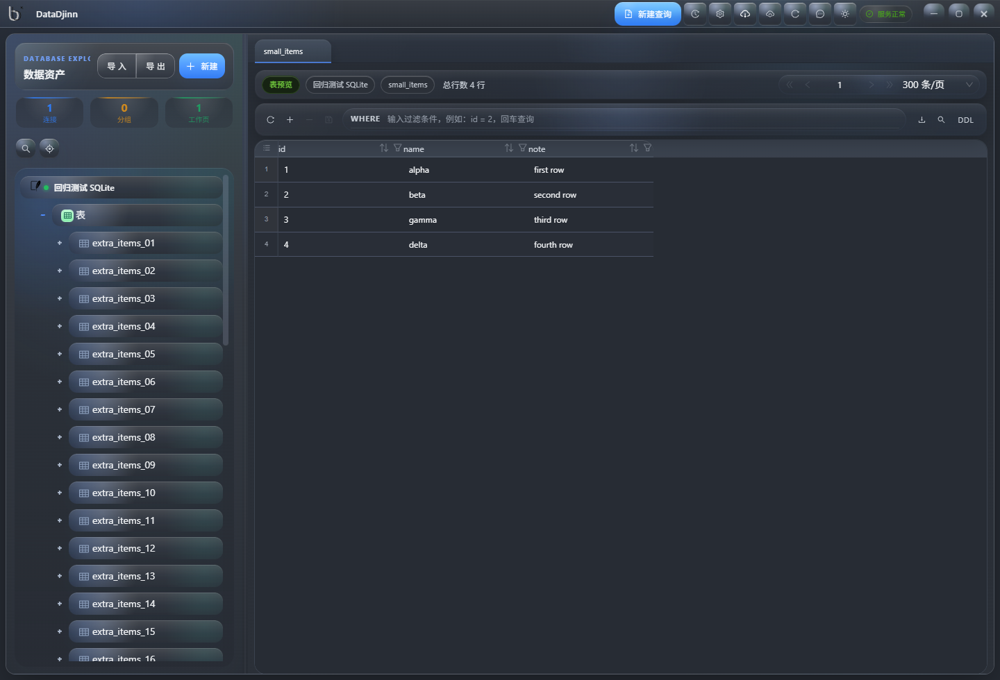
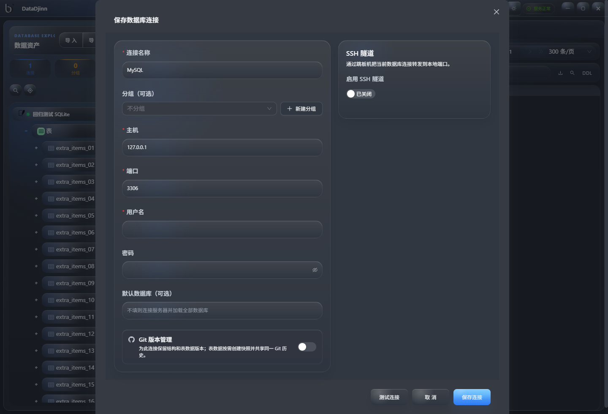
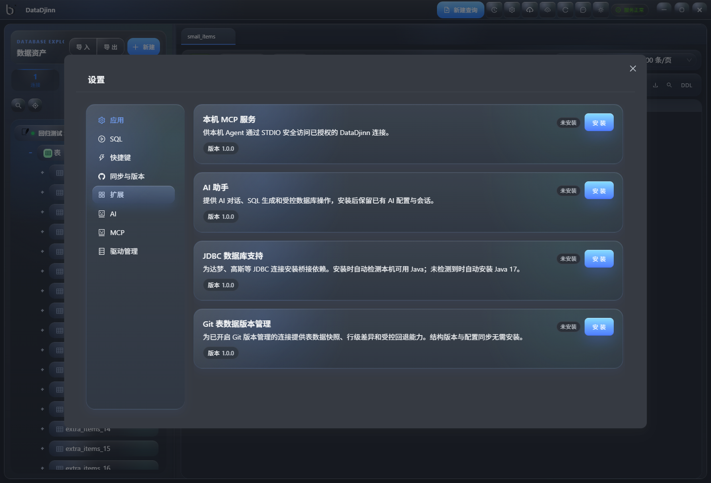
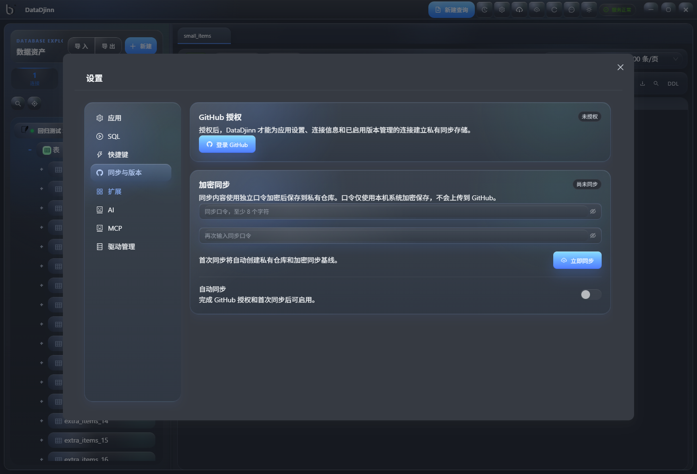

<p align="center">
  
</p>

<p align="center">
  <strong>本地优先、可扩展的桌面数据库管理工具</strong>
</p>

<p align="center">
  
  
  
  
  
</p>

---

## 简介

DataDjinn 是面向 Windows 的本地数据库客户端。它把连接管理、对象浏览、SQL 编辑、数据编辑、导入导出与可选的 AI、MCP、Git 同步和版本管理能力放进同一套桌面工作区。基础功能开箱即用，体积和依赖较大的能力按需安装。

当前最新版本：`v0.3.0`

## 核心能力

- 多数据库连接：SQLite、MySQL、PostgreSQL、Oracle、达梦 DM、高斯数据库、MongoDB、Redis、ClickHouse。
- 连接树：分组与子分组、拖拽排序、置顶、搜索定位、SSH 隧道、连接测试、静默重连和多种连接导入导出。
- SQL 工作区：Monaco 编辑器、多标签查询、SQL/存储过程补全、关键字高亮、语句级执行和逐条结果展示。
- 数据浏览与编辑：WHERE 过滤、分页、列搜索、列宽与列顺序调整、Excel 式 Ctrl/Shift 多选、行列选择、批量编辑、草稿状态和提交。
- 表结构与对象：浏览库、模式、表、视图、存储过程、集合和 Redis Key；查看 DDL、创建及修改关系型表结构。
- 数据迁移：SQL、CSV、JSON、Markdown 导入导出，关系型库备份恢复，MongoDB 与 Redis JSON 导出。
- 安全与体验：Windows DPAPI 本机密码保护、浅色/深色主题、自定义标题栏、后台更新检测。

## 工作区截图

### 连接、对象与 SQL 工作区


### 表格预览、筛选与草稿编辑



### 连接编辑、SSH 和 Git 版本管理开关



### 可选扩展



### GitHub 加密同步



## 可选扩展

在“设置 -> 扩展”中可查看、安装和卸载模块。下载、校验及解压期间会显示安装状态；已保存的配置会保留在本机，安装对应模块后可继续使用。

| 扩展 | 用途 | 默认状态 |
| --- | --- | --- |
| AI 助手 | 接入 OpenAI 兼容 API 或 Anthropic，提供 Schema 感知的问答、SQL 生成和受控数据库操作 | 未安装 |
| 本机 MCP 服务 | 通过 STDIO 向本机 Agent 暴露已授权的连接和数据库工具 | 未安装且关闭 |
| JDBC 数据库支持 | 为达梦、高斯等 JDBC 连接安装桥接运行时；自动检测 64 位 Java 8+，缺失时安装 Java 17 | 未安装 |
| Git 表数据版本管理 | 为已开启连接级 Git 版本管理的连接提供小表快照、提交历史和行级差异 | 未安装 |

达梦、高斯等商业数据库的 JDBC 驱动 JAR 仍需在“设置 -> 驱动管理”中本地导入，应用不托管驱动文件。

## GitHub 加密同步与版本管理

“设置 -> 同步与版本”可在应用中打开浏览器完成 GitHub 授权。设置独立同步口令后，连接信息、数据库与 SSH 密码、AI 配置和应用偏好会先用 AES-256-GCM 加密，再保存到自动创建的私有 GitHub 仓库。同步口令与同步基线仅保存在本机系统加密存储中，不会上传。

- 支持手动同步和每 15 分钟自动同步。
- 不同设备修改不同字段时会自动合并；同一字段冲突会显示本机与远程差异供选择。
- 连接树排序按完整树形结构处理，独立新增的分组或连接会保留原有归属。
- Java、JDBC 驱动和 SSH 私钥文件路径属于设备配置，不参与同步。

关系型连接可在新建或编辑时开启 Git 版本管理：MySQL、ClickHouse 按数据库纳管，PostgreSQL、高斯、达梦和 Oracle 按模式纳管，SQLite 自动管理当前库。已选范围会在首次打开和通过界面修改结构时创建结构快照，也可从连接旁 Git 图标或右键菜单查看历史和任一版本 DDL。

安装“Git 表数据版本管理”扩展后，可为不超过 5000 行的小表创建数据快照；标准表预览保存修改后会生成后续快照。带主键或单列唯一键的表可查看行级新增、删除和修改差异。当前不提供表数据回退，也不支持大表外部存储；MongoDB 和 Redis 不支持该功能。

## AI 与 MCP

AI 助手安装后，可在“设置 -> AI”配置 OpenAI 兼容 API（OpenAI、DeepSeek、通义千问、Ollama 等）或 Anthropic。AI 能读取当前连接内的数据库、模式和对象上下文，生成 SQL、解释数据与 Schema；写操作会先显示确认，不会直接提交。AI 对话、配置和会话记录只保存在本机，并可随模块重新安装恢复。

MCP 服务仅通过本机 STDIO 工作，不监听网络端口。安装 MCP 扩展后，还需在“设置 -> MCP”显式启用；界面会提供可复制的客户端配置命令。默认只读，可限制可访问的连接。需要写操作时，必须同时开启写权限，并由 Agent 在同一次调用中传入 `confirm_write=true`。

## 支持的数据库

| 数据库 | 主要驱动 | 说明 |
| --- | --- | --- |
| SQLite | sqlite3 | 本地文件数据库，即开即用 |
| MySQL | PyMySQL | 支持连接、对象浏览、数据编辑、结构管理和导入导出 |
| PostgreSQL | psycopg 3 | 支持数据库与模式层级浏览和管理 |
| Oracle | python-oracledb | 支持连接、对象浏览、表预览、DDL 与主要表结构操作 |
| 达梦 DM | JDBC jar / dmPython | 支持 DM8；驱动需从本地驱动管理导入 |
| 高斯数据库 | JDBC jar | 驱动需从本地驱动管理导入 |
| MongoDB | PyMongo | 数据库/集合浏览、字段推断、集合预览、命令执行与 JSON 导出 |
| Redis | redis-py | DB/Key 浏览与 String、Hash、List、Set、ZSet 编辑 |
| ClickHouse | clickhouse-connect | 数据库/表浏览、查询、结构查看和 SQL 执行 |

## 安装与开发

从 [Releases](https://github.com/vhukze/DataDjinn/releases) 下载：

- `DataDjinn-x.x.x-setup.exe`：Windows 安装包。
- `DataDjinn-x.x.x-win.zip`：Windows 解压即用版。

基础安装包内置 Python 运行时和基础后端依赖；AI、MCP、JDBC 和表数据版本管理等可选功能在首次使用时按需下载安装。

开发环境需要 Node.js 20+、Python 3.13+ 和 npm：

```powershell
git clone https://github.com/vhukze/DataDjinn.git
cd DataDjinn
npm install
cd backend
python -m venv .venv
.\.venv\Scripts\python.exe -m pip install -r requirements.txt
cd ..
npm run dev
```

常用命令：

```powershell
npm run dev
npm run typecheck
npm run test:regression:smoke -- --grep-invert=@bug
npm run build:win:all
```

## 技术栈

- 桌面层：Electron 39、electron-builder
- 前端：React 19、TypeScript、Vite 7、Ant Design 6、Monaco Editor、Zustand
- 后端：FastAPI、SQLAlchemy 2.x、PyMySQL、psycopg、PyMongo、redis-py、clickhouse-connect
- AI：OpenAI 兼容 API、Anthropic

## 许可证

[Apache License 2.0](LICENSE)
